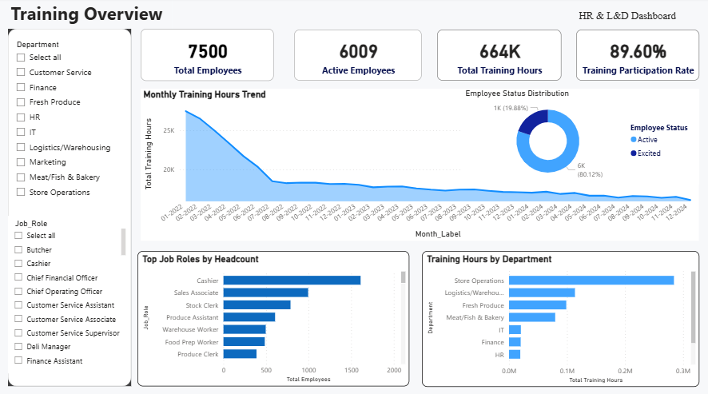

# Employee Training & Performance Dashboard

## Project Overview

This project analyzes employee training and workforce data to support HR and Learning & Development (L&D) reporting. The dashboard was built using Excel and Power BI to monitor employee headcount, active employee status, training hours, training participation rate, and department-level training metrics.

The main objective of this project is to practice data cleaning, KPI tracking, Excel reporting, and Power BI dashboard development for HR/Operations analytics.

## Dataset Description

This project uses a simulated HR Analytics dataset covering employee records from 2022 to 2024. The dataset contains nearly 500,000 records across multiple related tables, including employee information, monthly performance data, role-based KPIs, store information, and business outcomes.

For this project, the analysis focuses mainly on the following tables:

- `employees`: employee profile, department, job role, hire date, exit date, salary, store ID, and manager information.
- `monthly_performance`: monthly employee performance records, including training hours, performance rating, overtime hours, absenteeism days, employee satisfaction, engagement index, and manager evaluation.
- `role_kpis`: role-based KPI values and productivity index by employee and month.

## Project Scope

Although the full dataset can support broader HR Analytics analysis such as attrition, productivity, salary comparison, and business performance, this project focuses on HR/L&D reporting.

The dashboard was designed to answer the following questions:

- How many employees are included in the dataset?
- How many employees are active or exited?
- What is the total number of training hours?
- What is the training participation rate?
- How do training hours change over time?
- Which departments recorded the highest training volume?
- How is employee headcount distributed by job role?

## Tools Used

- Excel
- Power BI
- Power Query
- DAX

## Data Cleaning & Validation

Before building the dashboard, the dataset was checked using Excel formulas and validation steps.

Key checks included:

- Missing values in key employee, training, and performance fields
- Duplicate Employee ID records
- Duplicate Employee ID and Year-Month records
- Negative values in training hours, overtime hours, absenteeism days, bonus, and benefits cost
- Out-of-range values in employee satisfaction and performance-related fields

After validation, the main fields were ready for dashboard development.

## Key KPIs

| KPI | Value |
|---|---:|
| Total Employees | 7,500 |
| Active Employees | 6,009 |
| Exited Employees | 1,491 |
| Active Rate | 80.12% |
| Total Training Hours | 664,272 |
| Average Training Hours | 2.81 |
| Training Participation Rate | 89.60% |
| Average Performance Rating | 3.70 |
| Average Employee Satisfaction | 7.24 / 10 |
| Average Engagement Index | 7.22 |
| Average Absenteeism Days | 0.71 |
| Average Manager Evaluation | 3.70 |
| Average Productivity Index | 1.35 |

## Dashboard Preview

## Key Insights

- The dataset includes 7,500 employees, of which 6,009 are active, resulting in an active employee rate of 80.12%.
- Total training hours reached 664,272 hours across employee-month records.
- Training participation rate was 89.60%, showing a high level of employee involvement in training activities.
- Store Operations recorded the highest training volume among departments.
- Average employee satisfaction was 7.24/10, while the average engagement index was 7.22.
- Average absenteeism was 0.71 days per employee-month record.

## Business Value

This dashboard can support HR and L&D teams in:

- Monitoring employee training activities
- Tracking training participation
- Identifying departments with high or low training volume
- Supporting workforce and HR reporting
- Improving data-driven follow-up actions

## Project Outcome

This project demonstrates the ability to:

- Clean and validate HR-related data using Excel
- Summarize employee and training KPIs
- Build DAX measures in Power BI
- Create an interactive HR/L&D dashboard
- Present workforce and training insights clearly for reporting purposes
